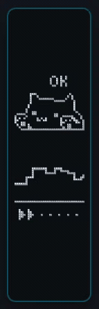
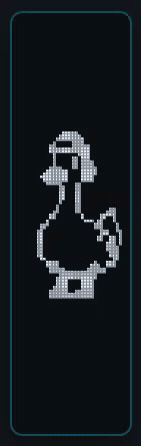
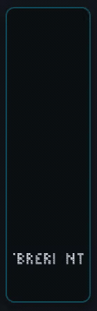
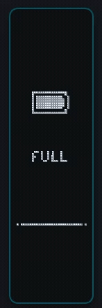
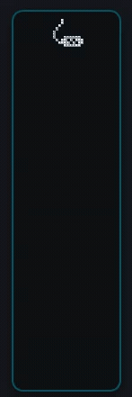
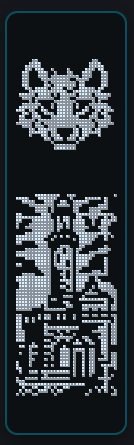

# Scyan ZMK Studio: Widget Examples & Gallery

Visual catalog, specifications, and live screencasts of widget instances supported by the **Scyan ZMK Studio** visual IDE and runtime blitter engine (**[`scyan-zmk-module`](https://github.com/BrunoWB/scyan-zmk-module)**).

All screen recordings below are authentic screencasts captured directly from the live OLED display simulator in Scyan ZMK Studio.

---

## Table of Contents

- [1. Gallery Overview](#1-gallery-overview)
- [2. Typing Speed & Metrics (`speed-widgets`)](#2-typing-speed--metrics-speed-widgets)
- [3. Mascots & Animations (`animation-widget`)](#3-mascots--animations-animation-widget)
- [4. Typewriter & Keypress Stream (`typewriter-widgets`)](#4-typewriter--keypress-stream-typewriter-widgets)
- [5. Battery & Power Status (`charge-widgets`)](#5-battery--power-status-charge-widgets)
- [6. Connection & Connectivity (`connection-widget`)](#6-connection--connectivity-connection-widget)
- [7. Static Images (`static-images`)](#7-static-images-static-images)
- [8. Devicetree Node Reference](#8-devicetree-node-reference)

---

## 1. Gallery Overview

| Typing Speed & WPM | Mascots & Animations | Typewriter & Keystrokes |
| :---: | :---: | :---: |
| [](assets/widgets/speed-widgets.webm)<br>([WebM Video](assets/widgets/speed-widgets.webm) · [MP4 Video](assets/widgets/speed-widgets.mp4)) | [](assets/widgets/animation-widget.webm)<br>([WebM Video](assets/widgets/animation-widget.webm) · [MP4 Video](assets/widgets/animation-widget.mp4)) | [](assets/widgets/typewriter-widgets.webm)<br>([WebM Video](assets/widgets/typewriter-widgets.webm) · [MP4 Video](assets/widgets/typewriter-widgets.mp4)) |
| *Real-time speedometer, chart & tiers* | *Looping walker duck animation* | *Stream, spot, random scatter & keypress* |

| Battery & Charging | Output & Connectivity | Static Images |
| :---: | :---: | :---: |
| [](assets/widgets/charge-widgets.webm)<br>([WebM Video](assets/widgets/charge-widgets.webm) · [MP4 Video](assets/widgets/charge-widgets.mp4)) | [](assets/widgets/connection-widget.webm)<br>([WebM Video](assets/widgets/connection-widget.webm) · [MP4 Video](assets/widgets/connection-widget.mp4)) | [](assets/widgets/static-images.png)<br>([High-Res PNG](assets/widgets/static-images.png)) |
| *Dynamic battery meter & charge states* | *USB & Bluetooth profile connection* | |

---

## 2. Typing Speed & Metrics (`speed-widgets`)

Live typing speed metrics updated dynamically on every keystroke event via Zephyr's event bus.

| Speed Widgets Screencast | Featured Widgets & Specifications |
| :---: | :--- |
| <br>([WebM Video](assets/widgets/speed-widgets.webm) · [MP4 Video](assets/widgets/speed-widgets.mp4)) | **1. WPM Oscilloscope Chart (`widget-wpm-chart`)**<br>• Real-time oscilloscope line chart tracking typing speed over a rolling 10s–30s window.<br>• Connected waveform line, baseline grid, and target speed threshold ($60$ WPM).<br><br>**2. Radial Speedometer Gauge (`widget-wpm`)**<br>• Needle gauge tracking instantaneous typing cadence with live numeric readout.<br><br>**3. Text Division Tier Meter (`widget-wpm`)**<br>• Dynamic speed tiers: `SLOW` ➔ `OK` ➔ `NICE` ➔ `GOOD` ➔ `WOW`. |

---

## 3. Mascots & Animations (`animation-widget`)

Interactive mascots and multi-frame animation loops reacting to user keystrokes.

| Animation Screencast | Featured Widgets & Specifications |
| :---: | :--- |
| <br>([WebM Video](assets/widgets/animation-widget.webm) · [MP4 Video](assets/widgets/animation-widget.mp4)) | **1. Infinite Walker Duck (`widget-loop`)**<br>• 51-frame looping walk cycle rendered from `SYMBOLS_ATLAS`.<br>• Smooth $100$ms frame rate with seamless cyclic wrapping.<br><br>**2. Reactive Mascots (`widget-bongo`)**<br>• Taps left and right paws to corresponding split keyboard halves.<br>• Custom mascot paws with typing burst synchronization. |

---

## 4. Typewriter & Keypress Stream (`typewriter-widgets`)

Displays keystroke input on the OLED in real-time with three distinct rendering algorithms alongside directional matrix illumination.

| Typewriter Screencast | Featured Widgets & Specifications |
| :---: | :--- |
| <br>([WebM Video](assets/widgets/typewriter-widgets.webm) · [MP4 Video](assets/widgets/typewriter-widgets.mp4)) | **1. Inline Stream (`widget-typewriter`, inline mode)**<br>• Streaming horizontal text buffer that auto-scrolls at the right boundary.<br><br>**2. Single Letter Spot (`widget-typewriter`, spot mode)**<br>• Pops the last typed character in large typography with idle auto-wipe.<br><br>**3. Random Scatter Matrix (`widget-typewriter`, random mode)**<br>• Matrix-style scatter with $4 \times 4$ Bayer ordered-dither phosphor decay.<br><br>**4. Directional Keypress Matrix (`widget-keypress`)**<br>• Up, Down, Left, Right directional navigation symbols with instant active illumination. |

---

## 5. Battery & Power Status (`charge-widgets`)

Essential power and charging monitoring with multi-tier fallbacks.

| Battery Screencast | Featured Widgets & Specifications |
| :---: | :--- |
| <br>([WebM Video](assets/widgets/charge-widgets.webm) · [MP4 Video](assets/widgets/charge-widgets.mp4)) | **1. Dynamic Battery Meter (`widget-battery`)**<br>• Multi-frame charging bolt symbol interpolation with real-time percentage fill.<br><br>**2. Battery Text Divisions (`widget-battery`)**<br>• Text division thresholds: `CHARGE NOW!`, `LOW`, `OK`, `FULL`.<br><br>**3. Slim Horizontal Battery (`widget-battery`)**<br>• Compact 1bpp horizontal fuel gauge optimized for dense status bars. |

---

## 6. Connection & Connectivity (`connection-widget`)

Wireless profiles, host interconnectivity, and lock indicators.

| Connection Screencast | Featured Widgets & Specifications |
| :---: | :--- |
| <br>([WebM Video](assets/widgets/connection-widget.webm) · [MP4 Video](assets/widgets/connection-widget.mp4)) | **1. Output Connection (`widget-output-status`)**<br>• USB cable plug icon when wired, or active BLE profile pills (`P1`–`P5`).<br><br>**2. Split Interconnect Link (`widget-split`)**<br>• Inter-half wireless link chain status (Linked / Unlinked).<br><br>**3. Caps Lock Indicator (`widget-caps-lock`)**<br>• Caps Lock state illumination badge. |

---

## 7. Static Images (`static-images`)

| Static Images |
| :---: |
| <br>([High-Res PNG](assets/widgets/static-images.png)) |

---

## 8. Devicetree Node Reference

All widgets shown above compile directly into native Zephyr Devicetree nodes in `config/scyan_layouts.dtsi`:

```dts
/* Example layout with Bongo Cat, WPM Chart, and Status Bar */
display_1_active: display_1_active {
    compatible = "scyan,display-layout";
    label = "Display 1 Active";

    /* Bongo Cat Mascot */
    widget_bongo: widget_bongo {
        compatible = "scyan,widget-bongo";
        x = <0>;
        y = <98>;
        width = <32>;
        height = <23>;
        symbol = <SYMBOL_SLICE_40_4046>;
    };

    /* Real-time WPM Line Chart */
    widget_wpm_chart: widget_wpm_chart {
        compatible = "scyan,widget-wpm-chart";
        x = <0>;
        y = <55>;
        width = <32>;
        height = <30>;
        grid-size = <0>;
        target-speed = <60>;
        time-window = <10>;
    };

    /* Output Connection */
    widget_connection: widget_connection {
        compatible = "scyan,widget-output-status";
        x = <1>;
        y = <0>;
        width = <12>;
        height = <10>;
        symbol = <SYMBOL_USB>;
    };

    /* Battery Meter */
    widget_battery: widget_battery {
        compatible = "scyan,widget-battery";
        x = <14>;
        y = <0>;
        width = <17>;
        height = <10>;
        symbol = <SYMBOL_CHARGE_0960>;
    };
};
```

---

*Authentic screencasts recorded in Scyan ZMK Studio. For architecture details, see [Architecture Reference](ARCHITECTURE.md).*
